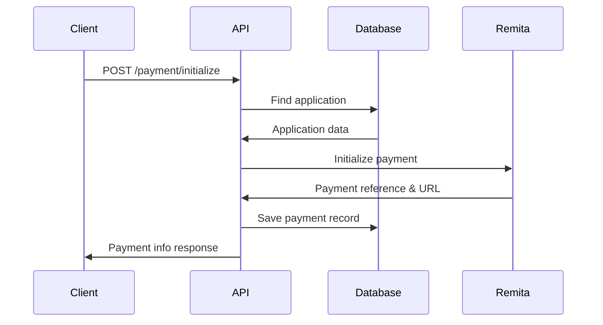

# 🧪 Payment Initialization Endpoint Testing Guide

## 📋 Overview

This guide shows you how to test the payment initialization endpoint `POST /api/transcripts/:id/payment/initialize` using different methods.

## 🎯 Endpoint Details

- **URL**: `POST {{base_url}}/api/transcripts/:id/payment/initialize`
- **Authentication**: Bearer Token Required
- **Purpose**: Initialize payment for a transcript application
- **Returns**: Payment reference (RRR) and payment URL

## 🚀 Testing Methods

### Method 1: Using Postman Collection (Recommended)

#### Step 1: Setup Authentication
1. **Open Postman Collection**: `UNIOSUN-TACDRA-CURRENT.postman_collection.json`
2. **Login as Student**:
   ```json
   POST {{base_url}}/auth/student/login
   {
     "matriculationNumber": "CSC/2020/100",
     "password": "Password123!"
   }
   ```
   - This will automatically set `{{access_token}}` variable

#### Step 2: Create an Application First
```json
POST {{base_url}}/api/transcripts/apply
Headers: Authorization: Bearer {{access_token}}
Body:
{
  "transcriptType": "official_copy",
  "deliveryMethod": "courier",
  "purpose": "Postgraduate Application",
  "institutionName": "University of Lagos",
  "institutionEmail": "admissions@unilag.edu.ng",
  "institutionAddress": "Akoka, Lagos State, Nigeria",
  "trackingReference": "UNILAG-PG-2024-001",
  "documentIds": ["doc-uuid-1", "doc-uuid-2"],
  "recipientName": "Admissions Officer",
  "recipientAddress": "University of Lagos, Akoka, Lagos",
  "recipientPhone": "+2348012345678"
}
```
- This will set `{{application_id}}` and `{{attn}}` variables

#### Step 3: Initialize Payment
```json
POST {{base_url}}/api/transcripts/{{application_id}}/payment/initialize
Headers: Authorization: Bearer {{access_token}}
```

**Expected Response**:
```json
{
  "message": "Payment initialized successfully",
  "paymentInfo": {
    "applicationId": "app-uuid-here",
    "attn": "TACDRA25010123456",
    "amount": 3000,
    "currency": "NGN",
    "paymentReference": "TACDRA-PAY-123456",
    "paymentUrl": "https://remita.net/pay/TACDRA-PAY-123456",
    "expiresAt": "2025-01-12T22:00:00.000Z"
  },
  "instructions": [
    "Click the payment link to complete payment",
    "Payment must be completed within 24 hours",
    "Keep your payment reference for tracking"
  ]
}
```

### Method 2: Using cURL Commands

#### Step 1: Login and Get Token
```bash
# Student Login
curl -X POST http://localhost:3002/auth/student/login \
  -H "Content-Type: application/json" \
  -d '{
    "matriculationNumber": "CSC/2020/100",
    "password": "Password123!"
  }'

# Save the access_token from response
export ACCESS_TOKEN="your-jwt-token-here"
```

#### Step 2: Create Application
```bash
curl -X POST http://localhost:3002/api/transcripts/apply \
  -H "Authorization: Bearer $ACCESS_TOKEN" \
  -H "Content-Type: application/json" \
  -d '{
    "transcriptType": "student_copy",
    "deliveryMethod": "email",
    "purpose": "Job Application",
    "documentIds": []
  }'

# Save the application.id from response
export APPLICATION_ID="app-uuid-here"
```

#### Step 3: Initialize Payment
```bash
curl -X POST http://localhost:3002/api/transcripts/$APPLICATION_ID/payment/initialize \
  -H "Authorization: Bearer $ACCESS_TOKEN" \
  -H "Content-Type: application/json"
```

### Method 3: Using VS Code REST Client

Create a file `test-payment.http`:

```http
### Login as Student
POST http://localhost:3002/auth/student/login
Content-Type: application/json

{
  "matriculationNumber": "CSC/2020/100",
  "password": "Password123!"
}

### Create Application
POST http://localhost:3002/api/transcripts/apply
Authorization: Bearer {{access_token}}
Content-Type: application/json

{
  "transcriptType": "student_copy",
  "deliveryMethod": "email",
  "purpose": "Job Application",
  "documentIds": []
}

### Initialize Payment
POST http://localhost:3002/api/transcripts/{{application_id}}/payment/initialize
Authorization: Bearer {{access_token}}
```

### Method 4: Node.js Test Script

Create `test-payment.js`:

```javascript
const axios = require('axios');

const BASE_URL = 'http://localhost:3002';

async function testPaymentInitialization() {
  try {
    // Step 1: Login
    console.log('🔐 Logging in...');
    const loginResponse = await axios.post(`${BASE_URL}/auth/student/login`, {
      matriculationNumber: 'CSC/2020/100',
      password: 'Password123!'
    });
    
    const token = loginResponse.data.access_token;
    console.log('✅ Login successful');

    // Step 2: Create application
    console.log('📝 Creating application...');
    const appResponse = await axios.post(`${BASE_URL}/api/transcripts/apply`, {
      transcriptType: 'student_copy',
      deliveryMethod: 'email',
      purpose: 'Job Application',
      documentIds: []
    }, {
      headers: { Authorization: `Bearer ${token}` }
    });
    
    const applicationId = appResponse.data.application.id;
    console.log('✅ Application created:', appResponse.data.application.attn);

    // Step 3: Initialize payment
    console.log('💳 Initializing payment...');
    const paymentResponse = await axios.post(
      `${BASE_URL}/api/transcripts/${applicationId}/payment/initialize`,
      {},
      { headers: { Authorization: `Bearer ${token}` } }
    );
    
    console.log('✅ Payment initialized successfully!');
    console.log('Payment Info:', paymentResponse.data.paymentInfo);
    
  } catch (error) {
    console.error('❌ Error:', error.response?.data || error.message);
  }
}

testPaymentInitialization();
```

Run with: `node test-payment.js`

## 🔍 Testing Scenarios

### Scenario 1: Successful Payment Initialization
```json
// Request
POST /api/transcripts/valid-app-id/payment/initialize
Authorization: Bearer valid-token

// Expected Response (200)
{
  "message": "Payment initialized successfully",
  "paymentInfo": {
    "applicationId": "app-uuid-here",
    "attn": "TACDRA25010123456",
    "amount": 3000,
    "currency": "NGN",
    "paymentReference": "TACDRA-PAY-123456",
    "paymentUrl": "https://remita.net/pay/TACDRA-PAY-123456",
    "expiresAt": "2025-01-12T22:00:00.000Z"
  }
}
```

### Scenario 2: Invalid Application ID
```json
// Request
POST /api/transcripts/invalid-id/payment/initialize
Authorization: Bearer valid-token

// Expected Response (404)
{
  "statusCode": 404,
  "message": "Application not found",
  "error": "Not Found"
}
```

### Scenario 3: Unauthorized Access
```json
// Request
POST /api/transcripts/app-id/payment/initialize
Authorization: Bearer invalid-token

// Expected Response (401)
{
  "statusCode": 401,
  "message": "Unauthorized",
  "error": "Unauthorized"
}
```

### Scenario 4: Payment Already Initialized
```json
// Request
POST /api/transcripts/paid-app-id/payment/initialize
Authorization: Bearer valid-token

// Expected Response (400)
{
  "statusCode": 400,
  "message": "Payment already initialized for this application",
  "error": "Bad Request"
}
```

### Scenario 5: Application Not Owned by User
```json
// Request
POST /api/transcripts/other-user-app-id/payment/initialize
Authorization: Bearer valid-token

// Expected Response (403)
{
  "statusCode": 403,
  "message": "Access denied. This application belongs to another user.",
  "error": "Forbidden"
}
```

## 🧪 Mock Testing (Without Real Remita)

If you want to test without connecting to Remita:

### Use Mock Endpoints
```json
// Test Mock Payment Initialization
POST {{base_url}}/test-remita/initialize-mock
Content-Type: application/json

{
  "applicationId": "test-app-123",
  "amount": 3000,
  "payerName": "John Doe",
  "payerEmail": "john.doe@student.uniosun.edu.ng",
  "payerPhone": "+2348123456789",
  "description": "UNIOSUN Transcript Application Payment"
}
```

## 📊 Response Status Codes

| Status Code | Meaning | Description |
|-------------|---------|-------------|
| 200 | Success | Payment initialized successfully |
| 400 | Bad Request | Invalid data or payment already exists |
| 401 | Unauthorized | Invalid or missing authentication token |
| 403 | Forbidden | User doesn't own the application |
| 404 | Not Found | Application not found |
| 500 | Server Error | Internal server error |

## 🔗 Integration Flow



## 🐛 Common Issues & Solutions

### Issue 1: "Application not found"
**Solution**: Ensure you're using the correct `application_id` from the application creation response

### Issue 2: "Unauthorized"
**Solution**: Check that your JWT token is valid and not expired

### Issue 3: "Access denied"
**Solution**: Ensure you're logged in as the user who created the application

### Issue 4: Remita connection errors
**Solution**: Check your Remita credentials in environment variables

## 📋 Pre-Testing Checklist

- [ ] NestJS application is running (`npm run start:dev`)
- [ ] Database is connected and tables exist
- [ ] User account exists (create via signup endpoint)
- [ ] Application exists (create via apply endpoint)
- [ ] Valid JWT token obtained (via login endpoint)
- [ ] Correct application ID is being used

## 🎯 Quick Test Command

```bash
# Complete test flow in one script
curl -s -X POST http://localhost:3002/auth/student/login \
  -H "Content-Type: application/json" \
  -d '{"matriculationNumber":"CSC/2020/100","password":"Password123!"}' | \
jq -r '.access_token' | \
(read token; \
curl -s -X POST http://localhost:3002/api/transcripts/apply \
  -H "Authorization: Bearer $token" \
  -H "Content-Type: application/json" \
  -d '{"transcriptType":"student_copy","deliveryMethod":"email","purpose":"Test","documentIds":[]}' | \
jq -r '.application.id' | \
(read appId; \
curl -X POST http://localhost:3002/api/transcripts/$appId/payment/initialize \
  -H "Authorization: Bearer $token" \
  -H "Content-Type: application/json"))
```

## 📞 Need Help?

If you encounter issues:
1. Check the server logs for detailed error messages
2. Verify your environment variables are set correctly
3. Ensure all required services (database, etc.) are running
4. Test with the provided Postman collection first

Happy testing! 🚀
